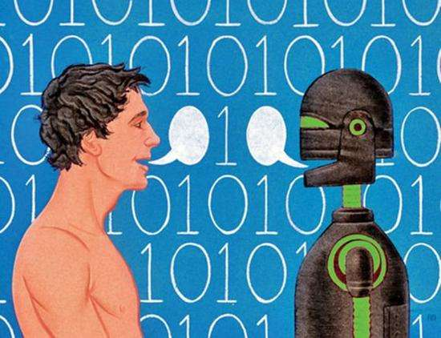
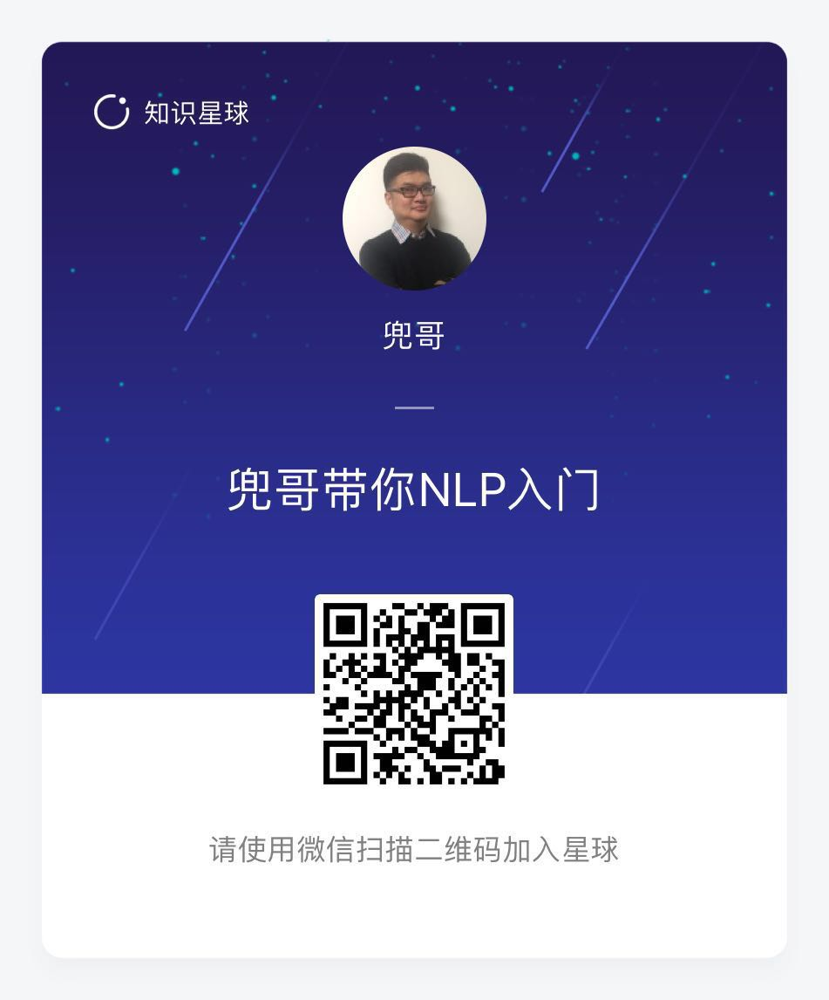

#让机器理解文字

图像、文字和声音是人类接触、理解外部世界最常见的三种形式，其中文字又是最容易保存和进行交换的形式。大量的人类文明，最终都是以文字的形式保留下来的；大量的信息交换，都是是文字的形式进行。如何能让机器可以与人交流，理解人类的思想，最终能像人类一样理解文字以及文字背后的各种想法、意图呢？自然语言处理，即所谓的NLP是重要的支撑技术。

NLP与安全

在传统的web攻防中，大家与http协议结下了不解之缘。但是在安全领域，web攻防只是很小一个分支。许多明显的与工作和生活无关的垃圾邮件，人一样就可以看出来，但是基于规则的垃圾邮件网关处理起来却总是差强人意。越来越多的电商、论坛甚至是视频网站的弹幕，总是可以看到明显的人身攻击或者违法违规信息，但是基于规则的过滤机制总是被绕过。人类可以很轻松的理解二十四口交换机，知道苹果是水果还是手机，但是机器如何做到呢？答案就是NLP。

一本开源的NLP入门书籍

这可能是第一本用开源的思想写的NLP入门书籍，整个写作过程都在我的Github上。

	https://github.com/duoergun0729/nlp

之所以想用开源的思路去写，主要是因为NLP技术，尤其是基于机器学习的NLP技术发展非常快，比如目前已经广泛使用的fasttext技术，2016年发布论文，2017年已经进入大量生产领域，但是许多自然语言处理书籍还停留在大学课程的范围，甚至连词向量都很少涉及。相对周期繁琐的纸质书籍编写，在Github上我可以很方便的进行编写和更新，有勘误也可以很快修改。目前我已经完成了其中的三篇，后面我将不断更新内容，大家可以订阅我的Github，或者关注我的微信公众号《**兜哥带你学安全**》

License

© 2018~2020 兜哥.

本作品采用[知识共享署名-非商业性使用 4.0 国际许可协议](https://creativecommons.org/licenses/by-nc/4.0/)进行许可。没有我许可的任何使用该书进行的商业行为都是违法。
	

打赏

写书不容易，尤其是使用个人休息时间的写作，感谢您的打赏，100不嫌多1块不嫌少。

如果您更喜欢知识星球这种形式，如果您对AI安全非常感兴趣，可以加入我的知识星球,AI安全相关的问题也可以在星球里面提问。

