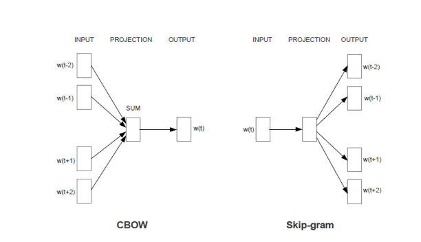
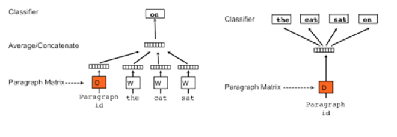

# Word2Vec模型
Word2Vec是Google在2013年开源的一款将词表征为实数值向量的高效工具，采用的模型有CBOW(Continuous Bag-Of-Words，即连续的词袋模型)和Skip-Gram 两种。Word2Vec通过训练，可以把对文本内容的处理简化为K维向量空间中的向量运算，而向量空间上的相似度可以用来表示文本语义上的相似度。因此，Word2Vec 输出的词向量可以被用来做很多NLP相关的工作，比如聚类、找同义词、词性分析等等。

 CBOW模型能够根据输入周围n-1个词来预测出这个词本身，而Skip-gram模型能够根据词本身来预测周围有哪些词。也就是说，CBOW模型的输入是某个词A周围的n个单词的词向量之和，输出是词A本身的词向量，而Skip-gram模型的输入是词A本身，输出是词A周围的n个单词的词向量。
Word2Vec最常用的开源实现之一就是gensim，网址为：

	http://radimrehurek.com/gensim/
gensim的安装非常简单：

	pip install --upgrade gensim
gensim的使用非常简洁，加载数据和训练数据可以合并，训练好模型后就可以按照单词获取对应的向量表示：

	sentences = [['first', 'sentence'], ['second', 'sentence']]
	model = gensim.models.Word2Vec(sentences, min_count=1)
	print model['first'] 
其中Word2Vec有很多可以影响训练速度和质量的参数。第一个参数可以对字典做截断，少于min_count次数的单词会被丢弃掉, 默认值为5：

	model = Word2Vec(sentences, min_count=10)
另外一个是神经网络的隐藏层的单元数，推荐值为几十到几百。事实上Word2Vec参数的个数也与神经网络的隐藏层的单元数相同，比如size=200，那么训练得到的Word2Vec参数个数也是200：
model = Word2Vec(sentences, size=200)
以处理IMDB数据集为例，初始化Word2Vec对象，设置神经网络的隐藏层的单元数为200，生成的词向量的维度也与神经网络的隐藏层的单元数相同。设置处理的窗口大小为8个单词，出现少于10次数的单词会被丢弃掉，迭代计算次数为10次，同时并发线程数与当前计算机的cpu个数相同：

	model=gensim.models.Word2Vec(size=200, window=8, min_count=10, iter=10, workers=cores)
	
其中当前计算机的cpu个数可以使用multiprocessing获取：

	cores=multiprocessing.cpu_count()
创建字典并开始训练获取Word2Vec。gensim的官方文档中强调增加训练次数可以提高生成的Word2Vec的质量，可以通过设置epochs参数来提高训练次数，默认的训练次数为5：

	x=x_train+x_test
	model.build_vocab(x)
	model.train(x, total_examples=model.corpus_count, epochs=model.iter)
	
经过训练后，Word2Vec会以字典的形式保存在model对象中，可以使用类似字典的方式直接访问获取，比如获取单词“love”的Word2Vec就可以使用如下形式：

	model[“love”]
	
Word2Vec的维度与之前设置的神经网络的隐藏层的单元数相同为200，也就是说是一个长度为200的一维向量。通过遍历一段英文，逐次获取每个单词对应的Word2Vec，连接起来就可以获得该英文段落对应的Word2Vec：

	def getVecsByWord2Vec(model, corpus, size):
	    x=[]
	    for text in corpus:
	        xx = []
	        for i, vv in enumerate(text):
	            try:
	                xx.append(model[vv].reshape((1,size)))
	            except KeyError:
	                continue
	        x = np.concatenate(xx)
	    x=np.array(x, dtype='float')
	    return x
需要注意的是，出于性能的考虑，我们将出现少于10次数的单词会被丢弃掉，所以存在这种情况，就是一部分单词找不到对应的Word2Vec，所以需要捕捉这个异常，通常使用python的KeyError异常捕捉即可。
基于上述的Word2Vec的方法，Quoc Le 和Tomas Mikolov又给出了Doc2Vec的训练方法。如下图所示，其原理与Word2Vec相同，分为Distributed Memory (DM) 和Distributed Bag of Words (DBOW)。

以处理IMDB数据集为例，初始化Doc2Vec对象，设置神经网络的隐藏层的单元数为200，生成的词向量的维度也与神经网络的隐藏层的单元数相同。设置处理的窗口大小为8个单词，出现少于10次数的单词会被丢弃掉，迭代计算次数为10次，同时并发线程数与当前计算机的cpu个数相同：

	model=Doc2Vec(dm=0, dbow_words=1, size=max_features, window=8, min_count=10, iter=10, workers=cores)
	
其中需要强调的是，dm为使用的算法，默认为1，表明使用DM算法，设置为0表明使用DBOW算法，通常使用默认配置即可，比如：

	model = gensim.models.Doc2Vec.Doc2Vec(size=50, min_count=2, iter=10)

# Doc2Vec
与Word2Vec不同的地方是，Doc2Vec处理的每个英文段落，需要使用一个唯一的标识标记，并且使用一种特殊定义的数据格式保存需要处理的英文段落，这种数据格式定义如下：

	SentimentDocument = namedtuple('SentimentDocument', 'words tags')
	
其中SentimentDocument可以理解为这种格式的名称，也可以理解为这种对象的名称，words会保存英文段落，并且是以单词和符合列表的形式保存，tags就是我们说的保存的唯一标识。最简单的一种实现就是依次给每个英文段落编号，训练数据集的标记为“TRAIN_数字”，训练数据集的标记为“TEST_数字”：

	def labelizeReviews(reviews, label_type):
	    labelized = []
	    for i, v in enumerate(reviews):
	        label = '%s_%s' % (label_type, i)
	        labelized.append(SentimentDocument(v, [label]))
	    return labelized
创建字典并开始训练获取Doc2Vec。与Word2Vec的情况一样，gensim的官方文档中强调增加训练次数可以提高生成的Doc2Vec的质量，可以通过设置epochs参数来提高训练次数，默认的训练次数为5：

	x=x_train+x_test
	model.build_vocab(x)
	model.train(x, total_examples=model.corpus_count, epochs=model.iter)
经过训练后，Doc2Vec会以字典的形式保存在model对象中，可以使用类似字典的方式直接访问获取，比如获取段落“I love tensorflow”的Doc2Vec就可以使用如下形式：

	model.docvecs[”I love tensorflow”]
	
一个典型的doc2ver展开为向量形式，内容如下所示，为了显示方便只展示了其中一部分维度的数据：

	array([ 0.02664499,  0.00475204, -0.03981256,  0.03796276, -0.03206162,
	        0.10963056, -0.04897128,  0.00151982, -0.03258783,  0.04711508,
	       -0.00667155, -0.08523653, -0.02975186,  0.00166316,  0.01915652,
	       -0.03415785, -0.05794788,  0.05110953,  0.01623618, -0.00512495,
	       -0.06385455, -0.0151557 ,  0.00365376,  0.03015811,  0.0229462 ,
	        0.03176891,  0.01117626, -0.00743352,  0.02030453, -0.05072152,
	       -0.00498496,  0.00151227,  0.06122205, -0.01811385, -0.01715777,
	        0.04883198,  0.03925886, -0.03568915,  0.00805744,  0.01654406,
	       -0.05160677,  0.0119908 , -0.01527433,  0.02209963, -0.10316766,
	       -0.01069367, -0.02432527,  0.00761799,  0.02763799, -0.04288232], dtype=float32)
	       
Doc2Vec的维度与之前设置的神经网络的隐藏层的单元数相同为200，也就是说是一个长度为200的一维向量。以英文段落为单位，通过遍历训练数据集和测试数据集，逐次获取每个英文段落对应的Doc2Vec，这里的英文段落就可以理解为数据集中针对电影的一段评价：

	def getVecs(model, corpus, size):
	    vecs = [np.array(model.docvecs[z.tags[0]]).reshape((1, size)) for z in corpus]
	    return np.array(np.concatenate(vecs),dtype='float')
    
训练Word2Vec和Doc2Vec是非常费时费力的过程，调试阶段会频繁更换分类算法以及修改分类算法参数调优，为了提高效率，可以把之前训练得到的Word2Vec和Doc2Vec模型保存成文件形式，以Doc2Vec为例，使用model.save函数把训练后的结果保存在本地硬盘上，运行程序时，在初始化Doc2Vec对象之前，可以先判断本地硬盘是否存在模型文件，如果存在就直接读取模型文件初始化Doc2Vec对象，反之则需要训练数据：

	if os.path.exists(doc2ver_bin):
	    print "Find cache file %s" % doc2ver_bin
	    model=Doc2Vec.load(doc2ver_bin)
	else:
	    model=Doc2Vec(size=max_features, window=5, min_count=2, workers=cores,iter=40)
	    model.build_vocab(x))
	    model.train(x, total_examples=model.corpus_count, epochs=model.iter)
	    model.save(doc2ver_bin)
 
