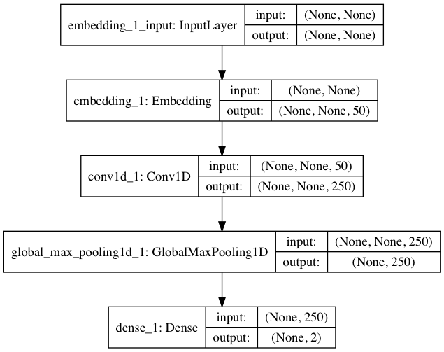
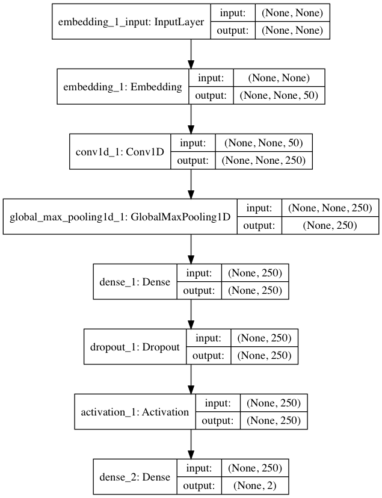

# 数据集
Yelp Reviews是Yelp为了学习目的而发布的一个开源数据集。它包含了由数百万用户评论，商业属性和来自多个大都市地区的超过20万张照片。这是一个常用的全球NLP挑战数据集，包含5,200,000条评论，174,000条商业属性。 数据集下载地址为：

	https://www.yelp.com/dataset/download

Yelp Reviews格式分为JSON和SQL两种，以JSON格式为例,其中最重要的review.json,包含评论数据。Yelp Reviews数据量巨大，非常适合验证CNN模型。

# 特征提取

特征提取使用词袋序列模型和词向量。
## 词袋序列模型
词袋序列模型是在词袋模型的基础上发展而来的，相对于词袋模型，词袋序列模型可以反映出单词在句子中的前后关系。keras中通过Tokenizer类实现了词袋序列模型，这个类用来对文本中的词进行统计计数，生成文档词典，以支持基于词典位序生成文本的向量表示，创建该类时，需要设置词典的最大值。

	tokenizer = Tokenizer(num_words=None)
	
Tokenizer类的示例代码如下：

	from keras.preprocessing.text import Tokenizer
	
	text1='some thing to eat'
	text2='some thing to drink'
	texts=[text1,text2]
	
	tokenizer = Tokenizer(num_words=None) 
	#num_words:None或整数,处理的最大单词数量。少于此数的单词丢掉
	tokenizer.fit_on_texts(texts)
	
	# num_words=多少会影响下面的结果，行数=num_words
	print( tokenizer.texts_to_sequences(texts)) 
	#得到词索引[[1, 2, 3, 4], [1, 2, 3, 5]]
	print( tokenizer.texts_to_matrix(texts))  
	# 矩阵化=one_hot
	[[ 0.,  1.,  1.,  1.,  1.,  0.,  0.,  0.,  0.,  0.],
	 [ 0.,  1.,  1.,  1.,  0.,  1.,  0.,  0.,  0.,  0.]]

在处理Yelp数据集时，把每条评论看成一个词袋序列，且长度固定。超过固定长度的截断，不足的使用0补齐。

	#转换成词袋序列，max_document_length为序列的最大长度
	max_document_length=200
	
	#设置分词最大个数 即词袋的单词个数
	tokenizer = Tokenizer(num_words=max_features)
	tokenizer.fit_on_texts(text)
	sequences = tokenizer.texts_to_sequences(text)
	 #截断补齐
	x=pad_sequences(sequences, maxlen=max_document_length)
	
## 词向量模型
词向量模型常见实现形式有word2Vec,fastText和GloVe，本章使用最基础的word2Vec，基于gensim库实现。为了提高性能，使用了预训练好的词向量，即使用Google News dataset数据集训练出的词向量。加载方式为：

	model =
	word2vec.Word2Vec.load_word2vec_format('GoogleNews-vectors-negative300.bin',binary=True)

# 衡量指标
使用5折交叉验证，并且考核F1的值，训练轮数为10轮，批处理大小为128。
	
	clf = KerasClassifier(build_fn=baseline_model, epochs=10, batch_size=128, verbose=0)
		
	#使用5折交叉验证
	scores = cross_val_score(clf, x, encoded_y, cv=5, scoring='f1_micro')
	# print scores
	print("f1_micro: %0.2f (+/- %0.2f)" % (scores.mean(), scores.std() * 2))

# 单层CNN模型
我们尝试使用单层CNN结构来处理Yelp的分类问题。首先通过一个Embedding层，降维成为50位的向量，然后使用一个核数为250，步长为1的一维CNN层进行处理，接着连接一个池化层。为了防止过拟合，CNN层和全连接层之间随机丢失20%的数据进行训练。

    #CNN参数
    embedding_dims = 50
    filters = 250
    kernel_size = 3
    hidden_dims = 250

    model = Sequential()
    model.add(Embedding(max_features, embedding_dims))

    model.add(Conv1D(filters,
                     kernel_size,
                     padding='valid',
                     activation='relu',
                     strides=1))
    #池化
    model.add(GlobalMaxPooling1D())

    model.add(Dense(2, activation='softmax'))

    model.compile(loss='categorical_crossentropy',
                  optimizer='adam',
                  metrics=['accuracy'])
                  
损失函数使用交叉熵categorical_crossentropy，优化算法使用adsm，可视化结果如下。

打印CNN的结构。

	model.summary()

输出的结果如下所示，除了显示模型的结构，还可以显示需要训练的参数信息。

	_________________________________________________________________
	Layer (type)                 Output Shape              Param #   
	=================================================================
	embedding_1 (Embedding)      (None, None, 50)          250000    
	_________________________________________________________________
	conv1d_1 (Conv1D)            (None, None, 250)         37750     
	_________________________________________________________________
	global_max_pooling1d_1 (Glob (None, 250)               0         
	_________________________________________________________________
	dense_1 (Dense)              (None, 2)                 502       
	=================================================================
	Total params: 288,252
	Trainable params: 288,252
	Non-trainable params: 0
	_________________________________________________________________
	
当特征提取使用词袋序列，特征数取5000的前提下，结果如下。

<table>
    <tr>
        <td>数据量</td>
        <td>F1值</td>
    </tr>
    <tr>
        <td>1w</td>
        <td>0.86</td>
    </tr>
    <tr>
        <td>10w</td>
        <td>0.92</td>
    </tr>     
</table>

# 单层CNN+MLP模型
在单层CNN的基础上增加一个隐藏层，便于更好的分析CNN层提取的高级特征，该隐藏层结点数为250。

    #CNN参数
    embedding_dims = 50
    filters = 250
    kernel_size = 3
    hidden_dims = 250

    model = Sequential()
    model.add(Embedding(max_features, embedding_dims))

    model.add(Conv1D(filters,
                     kernel_size,
                     padding='valid',
                     activation='relu',
                     strides=1))
    #池化
    model.add(GlobalMaxPooling1D())

    #增加一个隐藏层
    model.add(Dense(hidden_dims))
    model.add(Dropout(0.2))
    model.add(Activation('relu'))

    #输出层

    model.add(Dense(2, activation='softmax'))

    model.compile(loss='categorical_crossentropy',
                  optimizer='adam',
                  metrics=['accuracy'])

可视化结果如下。

打印CNN的结构。

	model.summary()

输出的结果如下所示，除了显示模型的结构，还可以显示需要训练的参数信息。

	_________________________________________________________________
	Layer (type)                 Output Shape              Param #   
	=================================================================
	embedding_1 (Embedding)      (None, None, 50)          250000    
	_________________________________________________________________
	conv1d_1 (Conv1D)            (None, None, 250)         37750     
	_________________________________________________________________
	global_max_pooling1d_1 (Glob (None, 250)               0         
	_________________________________________________________________
	dense_1 (Dense)              (None, 250)               62750     
	_________________________________________________________________
	dropout_1 (Dropout)          (None, 250)               0         
	_________________________________________________________________
	activation_1 (Activation)    (None, 250)               0         
	_________________________________________________________________
	dense_2 (Dense)              (None, 2)                 502       
	=================================================================
	Total params: 351,002
	Trainable params: 351,002
	Non-trainable params: 0
	_________________________________________________________________
	
当特征提取使用词袋序列，特征数取5000的前提下，结果如下，可以增加数据量可以提升性能。在数据量相同的情况下，比单层CNN效果略好。

<table>
    <tr>
        <td>数据量</td>
        <td>F1值</td>
    </tr>
    <tr>
        <td>1w</td>
        <td>0.87</td>
    </tr>
    <tr>
        <td>10w</td>
        <td>0.93</td>
    </tr>     
</table>

# TextCNN
TextCNN是利用卷积神经网络对文本进行分类的算法，由Yoon Kim中提出，本质上分别使用大小为3，4和5的一维卷积处理文本数据。这里的文本数据可以是定长的词袋序列模型，也可以使用词向量。

TextCNN的一种实现方式，就是分别使用大小为3，4和5的一维卷积处理输入，然后使用MaxPooling1D进行池化处理，并将处理的结果使用Flatten层压平并展开。把三个卷积层的结果合并，作为下一个隐藏层的输入，为了防止过拟合，丢失50%的数据进行训练。

	 #CNN参数
    embedding_dims = 50
    filters = 100

    # Inputs
    input = Input(shape=[max_document_length])

    # Embeddings layers
    x = Embedding(max_features, embedding_dims)(input)

    # conv layers
    convs = []
    for filter_size in [3,4,5]:
        l_conv = Conv1D(filters=filters, kernel_size=filter_size, activation='relu')(x)
        l_pool = MaxPooling1D()(l_conv)
        l_pool = Flatten()(l_pool)
        convs.append(l_pool)

    merge = concatenate(convs, axis=1)

    out = Dropout(0.5)(merge)

    output = Dense(32, activation='relu')(out)

    output = Dense(units=2, activation='softmax')(output)

    #输出层
    model = Model([input], output)

    model.compile(loss='categorical_crossentropy',
                  optimizer='adam',
                  metrics=['accuracy'])
可视化结果如下。

打印CNN的结构。

	model.summary()

输出的结果如下所示，除了显示模型的结构，还可以显示需要训练的参数信息。

	__________________________________________________________________________________________________
	Layer (type)                    Output Shape         Param #     Connected to                     
	==================================================================================================
	input_1 (InputLayer)            (None, 200)          0                                            
	__________________________________________________________________________________________________
	embedding_1 (Embedding)         (None, 200, 50)      250000      input_1[0][0]                    
	__________________________________________________________________________________________________
	conv1d_1 (Conv1D)               (None, 198, 100)     15100       embedding_1[0][0]                
	__________________________________________________________________________________________________
	conv1d_2 (Conv1D)               (None, 197, 100)     20100       embedding_1[0][0]                
	__________________________________________________________________________________________________
	conv1d_3 (Conv1D)               (None, 196, 100)     25100       embedding_1[0][0]                
	__________________________________________________________________________________________________
	max_pooling1d_1 (MaxPooling1D)  (None, 99, 100)      0           conv1d_1[0][0]                   
	__________________________________________________________________________________________________
	max_pooling1d_2 (MaxPooling1D)  (None, 98, 100)      0           conv1d_2[0][0]                   
	__________________________________________________________________________________________________
	max_pooling1d_3 (MaxPooling1D)  (None, 98, 100)      0           conv1d_3[0][0]                   
	__________________________________________________________________________________________________
	flatten_1 (Flatten)             (None, 9900)         0           max_pooling1d_1[0][0]            
	__________________________________________________________________________________________________
	flatten_2 (Flatten)             (None, 9800)         0           max_pooling1d_2[0][0]            
	__________________________________________________________________________________________________
	flatten_3 (Flatten)             (None, 9800)         0           max_pooling1d_3[0][0]            
	__________________________________________________________________________________________________
	concatenate_1 (Concatenate)     (None, 29500)        0           flatten_1[0][0]                  
	                                                                 flatten_2[0][0]                  
	                                                                 flatten_3[0][0]                  
	__________________________________________________________________________________________________
	dropout_1 (Dropout)             (None, 29500)        0           concatenate_1[0][0]              
	__________________________________________________________________________________________________
	dense_1 (Dense)                 (None, 32)           944032      dropout_1[0][0]                  
	__________________________________________________________________________________________________
	dense_2 (Dense)                 (None, 2)            66          dense_1[0][0]                    
	==================================================================================================
	Total params: 1,254,398
	Trainable params: 1,254,398
	Non-trainable params: 0
	__________________________________________________________________________________________________

当特征提取使用词袋序列，特征数取5000的前提下，结果如下，可以看出增加数据量可以提升性能。在数据量相同的情况下，比单层CNN效果略好，与CNN+MLP效果相当。

<table>
    <tr>
        <td>数据量</td>
        <td>F1值</td>
    </tr>
    <tr>
        <td>1w</td>
        <td>0.88</td>
    </tr>
    <tr>
        <td>10w</td>
        <td>0.92</td>
    </tr>     
</table>

# 参考文献

- Convolutional Neural Networks for Sentence Classification
- http://www.wildml.com/2015/11/understanding-convolutional-neural-networks-for-nlp/