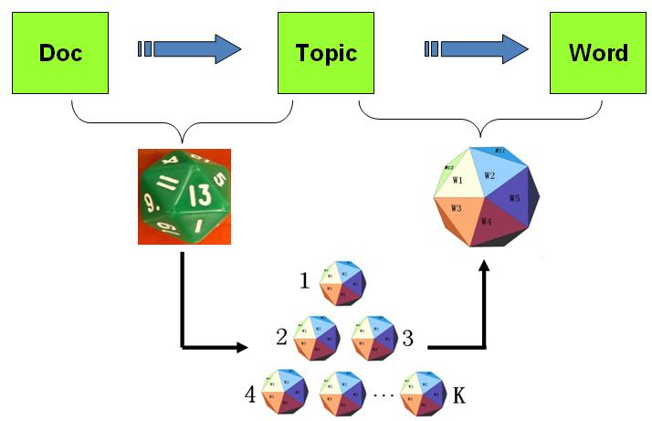
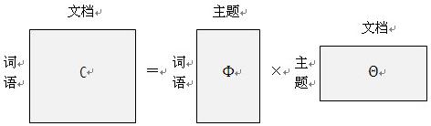

# LDA简介
LDA（Latent Dirichlet Allocation）是一种文档主题模型，包含词、主题和文档三层结构。

LDA认为一篇文档由一些主题按照一定概率组成，一个主题又由一些词语按照一定概率组成。早期人们用词袋模型对一篇文章进行建模，把一篇文档表示为若干单词的计数。无论是中文还是英文，都由大量单词组成，这就造成词袋向量的维数巨大，少则几千多则上万，在使用分类模型进行训练时，非常容易造成训练缓慢以及过拟合。LDA本质上把词袋模型进行了降维，把一篇文档以主题的形式进行了表示。主题的个数通常为几百，这就把文档使用了维数为几百的向量进行了表示，大大加快了训练速度，并且相对不容易造成过拟合。从某种程度上来说，主题是对若干词语的抽象表示。

以最近一部电视剧《南方有乔木》为例。假设一篇文章介绍了这部电视剧的主要内容。我们可以把这篇文章表示为：

	0.30*"创业"+0.3*"三角恋"+0.2*"无人机"

然后我们可以把三角恋表示为：

	0.4*"南乔"+0.3*"时樾"+0.3*"安宁"

需要指出的是，计算出文档、主题以及词语之间的表示关系，需要基于大量的文档，这样才具有普遍的意义。LDA正是提供了这种算法，自动从训练文档中计算出这种对应关系。

# 数据集
本文演示用的数据集，依然使用搜狗新闻数据集SogouCS。我们从SogouCS中提取正文内容，每个URL对应的正文当做一篇文档，并且使用jieba进行了分词。演示期间我们提取SogouCS的前10000条数据用于计算LDA。

	def load_sougou_content():
	    with open("../data/news_sohusite_content_10000.txt") as F:
	        content=F.readlines()
	        F.close()
	    return content

计算LDA时，需要删除停用词，加载我们之前保存的停用词。

	def load_stopwords():
	    with open("stopwords.txt") as F:
	        stopwords=F.readlines()
	        F.close()
	    return [word.strip() for word in stopwords]

# 计算主题

我们使用gensim提供的API进行LDA计算。首先从语料中提取字典，并用该字典把预料转换成词袋。

	 # 得到文档-单词矩阵 （直接利用统计词频得到特征）
	 dictionary = corpora.Dictionary(content)
	 # 将dictionary转化为一个词袋，得到文档-单词矩阵
	 texts = [dictionary.doc2bow(text) for text in content]
	 
然后进行LDA计算,演示期间设置只计算5个主题，通常生产环境经验值为200。

    num_topics=5
    lda = models.ldamodel.LdaModel(corpus=texts, id2word=dictionary, num_topics=num_topics)

其中比较重要的几个参数含义如下：
	
- corpus，计算LDA的语料
- id2word，语料对应的字典
- num_topics，计算的主题的数量

我们打印前5个主题。

    for index,topic in lda.print_topics(5):
        print topic

主题内容如下所示。

	0.007*"月" + 0.006*"中" + 0.005*"年" + 0.005*"日" + 0.004*"公司" + 0.004*"时间" + 0.003*"北京" + 0.003*"比赛" + 0.002*"中国" + 0.002*"记者"
	
	0.006*"月" + 0.006*"发展" + 0.005*"年" + 0.005*"日" + 0.005*"中" + 0.005*"中国" + 0.004*"工作" + 0.004*"说" + 0.003*"记者" + 0.003*"建设"
	
	0.008*"月" + 0.007*"市场" + 0.006*"经济" + 0.005*"增长" + 0.004*"元" + 0.004*"中国" + 0.004*"企业" + 0.004*"产品" + 0.004*"年" + 0.004*"记者"
	
	0.011*"日" + 0.011*"月" + 0.007*"记者" + 0.005*"时" + 0.005*"年" + 0.004*"公司" + 0.004*"说" + 0.004*"中" + 0.003*"发现" + 0.002*"亿元"
	
	0.006*"ｏ" + 0.006*"ｉ" + 0.006*"月" + 0.005*"日" + 0.005*"ｅ" + 0.005*"说" + 0.005*"ｎ" + 0.005*"中" + 0.004*"中国" + 0.004*"ａ"

词袋处理后的结果，使用TFIDF算法处理后，可以进一步提升LDA的效果。

    # 利用tf-idf来做为特征进行处理
    texts_tf_idf = models.TfidfModel(texts)[texts]
    lda = models.ldamodel.LdaModel(corpus=texts_tf_idf, id2word=dictionary, num_topics=num_topics)
    
运行的效果如下所示。

	0.001*"比赛" + 0.001*"联赛" + 0.001*"意甲" + 0.001*"主场" + 0.001*"轮" + 0.001*"赛季" + 0.001*"时间" + 0.001*"孩子" + 0.001*"北京" + 0.000*"航天员"
	
	0.001*"叙利亚" + 0.001*"奥运会" + 0.001*"伦敦" + 0.000*"选手" + 0.000*"中国" + 0.000*"说" + 0.000*"男子" + 0.000*"米" + 0.000*"北京" + 0.000*"日"
	
	0.000*"梅西" + 0.000*"林书豪" + 0.000*"鲁尼" + 0.000*"稀土" + 0.000*"钓鱼岛" + 0.000*"巴萨" + 0.000*"试用" + 0.000*"常规赛" + 0.000*"蛋黄派" + 0.000*"尼克斯"
	
	0.002*"体育" + 0.001*"搜狐" + 0.001*"北京" + 0.001*"ｏ" + 0.001*"时间" + 0.001*"ｎ" + 0.001*"ｉ" + 0.001*"日" + 0.001*"Ｃ" + 0.001*"ｅ"
	
	0.001*"市场" + 0.001*"经济" + 0.001*"增长" + 0.001*"投资" + 0.001*"亿元" + 0.001*"基金" + 0.001*"公司" + 0.001*"银行" + 0.001*"企业" + 0.001*"同比"

# 使用LDA提取文档特征
通常LDA的结果可以作为进一步文档分类、文档相似度计算以及文档聚类的依据，可以把LDA当做一种特征提取方法。

	#获取语料对应的LDA特征
	corpus_lda = lda[texts_tf_idf]
	#打印0号文档对应的LDA值
	print corpus_lda[0]

输出0号文档对应的LDA值如下，即把0号文档以5个话题形式表示。

	[(0, 0.019423252), (1, 0.019521076), (2, 0.92217809), (3, 0.01954053), (4, 0.019337002)]

这里需要解释的是，无论是词袋模型还是LDA生成的结果，都可能存在大量的0，这会占用大量的内存空间。因此默认情况下，词袋以及LDA计算的结果都以稀疏矩阵的形式保存。稀疏矩阵的最小单元定义为：

	（元素所在的位置，元素的值）

比如一个稀疏矩阵只有0号和2号元素不为0，分别为1和5，那么它的表示方法如下：

	[(0,1),(2,5)]
	

# 使用多核计算

LDA在生产环境中运行遇到的最大问题就是默认只能使用单核资源，运行速度过慢。gensim针对这一情况也提供了多核版本。

	lda = models.ldamulticore.LdaMulticore(corpus=texts_tf_idf, id2word=dictionary, num_topics=num_topics)

该版本默认情况默认使用cpu_count()-1 即使用几乎全部CPU，仅保留一个CPU不参与LDA计算，也可以通过参数workers指定使用的CPU个数，这里的CPU指的物理CPU，不是超线程的CPU数。一般认为：

	CPU总核数 = 物理CPU个数 * 每颗物理CPU的核数 
	总逻辑CPU数 = 物理CPU个数 * 每颗物理CPU的核数 * 超线程数

可以尝试使用如下命令查看服务器的CPU信息。

	# 查看CPU信息（型号）
	cat /proc/cpuinfo | grep name | cut -f2 -d: | uniq -c
	24         Intel(R) Xeon(R) CPU E5-2630 0 @ 2.30GHz
	
	# 查看物理CPU个数
	cat /proc/cpuinfo| grep "physical id"| sort| uniq| wc -l
	2
	
	# 查看每个物理CPU中core的个数(即核数)
	cat /proc/cpuinfo| grep "cpu cores"| uniq
	cpu cores    : 6
	
	# 查看逻辑CPU的个数
	cat /proc/cpuinfo| grep "processor"| wc -l
	24

## 性能指标

gensim官网上公布了一组测试数据，数据集为Wikipedia英文版数据集，该数据集有350万个文档，10万个特征，话题数设置为100的情况下运行LDA算法。硬件环境为一台拥有4个物理i7 CPU的服务器。使用单核接口需要使用3小时44分，当使用多核接口且使用3个物理CPU仅需要1小时6分钟。我们延续上面的例子，继续使用搜狗的数据集，为了要效果更加明显，我们使用SogouCS的前50000的数据进行LDA运算，话题数设置为100，并使用time.clock()获取当前时间，便于计算各个环节消耗的时间，比如计算LDA消耗的时间的方法如下所示。

	#获取当前时间
    start = time.clock()
    #workers指定使用的CPU个数 默认使用cpu_count()-1 即使用几乎全部CPU 仅保留一个CPU不参与LDA计算
    lda = models.ldamulticore.LdaMulticore(corpus=texts_tf_idf, id2word=dictionary, num_topics=num_topics)
    #计算耗时
    end = time.clock()
    print('[lda]Running time: %s Seconds' % (end - start))

分别计算使用1，2，4个CPU的情况，统计了预处理环节、LDA环节的耗时，其中预处理环节主要进行了词袋处理和TFIDF处理。

<table>
    <tr>
        <td>CPU数</td>
        <td>预处理环节耗时（单位：秒） </td>
        <td>LDA环节耗时（单位：秒） </td>
    </tr>
    <tr>
        <td>默认</td>
        <td>24</td>
        <td>169</td>
    </tr>
    <tr>
        <td>1</td>
        <td>25</td>
        <td>437</td>
    </tr>
    <tr>
        <td>2</td>
        <td>24</td>
        <td>296</td>
    </tr>
    <tr>
        <td>4</td>
        <td>25</td>
        <td>215</td>
    </tr>
    <tr>
        <td>6</td>
        <td></td>
        <td></td>
    </tr>
    </table>

## 在线学习
LDA的多核版本除了可以充分使用服务器的计算资源，还可以进行在线学习，动态更新模型。

	lda = LdaMulticore(corpus, num_topics=10)
	lda.update(other_corpus)
	
	

# 参考文档

- http://www.52nlp.cn/lda-math-文本建模
- https://radimrehurek.com/gensim/models/ldamulticore.html
- Hoffman, Blei, Bach: Online Learning for Latent Dirichlet Allocation, NIPS 2010.