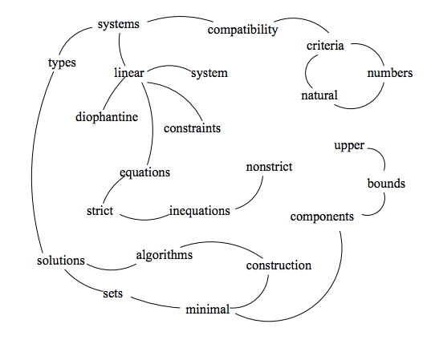

# 文档关键字
早期的信息检索平台并没有如今这么发达，大量的类似论坛、wiki的信息发布网站都依赖文档的关键字进行文档检索。即使是在如今的互联网世界，大量的信息检索还要依赖关键字。依靠人工归纳文章的关键字虽然相对准确，但是面对信息爆炸的互联网，这几乎成为了不可能的任务。本章将介绍如何使用TextRank和TFIDF算法自动提取文档的关键字。
# TextRank
TextRank的思路来自于PageRank。PageRank最开始用来计算网页的重要性。整个互联网可以看作一张有向图，节点是网页。如果网页A存在到网页B的链接，那么有一条从网页A指向网页B的有向边，指向同一个网页的链接越多，该网页的重要性或者说PageRank值更大。综合考虑Title和Keywords等其它因素之后，Google通过PageRank来调整结果，使那些更重要的网页在搜索结果排名更靠前。

TextRank的原理和PageRank类似，一篇文档去掉停用词以后，每个单词相当于一个网页，有时候也会指定某些词性的单词才参与计算TextRank，比如名词和动词。网页有明显的指向关系，但是文档的单词之间只有前后关系，所以要指定一个滑动的窗口大小，比如前后5个单词。在滑动窗口内的单词之间的前后关系当做网页之间的指向关系，参与TextRank的计算。

# TFIDF
TFIDF在本书中多次提到了，它同样可以用于提取关键字。TFIDF的一个基本假设是，一个单词的重要性由词频决定，如果一个单词在一句话里出现频率高，同时在其他句子里出现频率低，那么这个单词对这句话就非常重要，对于一个文档也是如此。
# 测试数据
测试数据挑选了写本章时的一条新闻，新闻内容如下：

>
据半岛电视台援引叙利亚国家电视台称，叙利亚已经对美国、英国、法国的空袭进行了反击。据介绍，在叙军武器库中，对西方最具威慑力的当属各型战术地对地弹道导弹。尽管美英法是利用巡航导弹等武器发动远程空袭，但叙军要对等还击却几乎是“不可能完成的任务”。目前叙军仍能作战的战机仍是老旧的苏制米格-29、米格-23、米格-21战斗机和苏-22、苏-24轰炸机，它们在现代化的西方空军面前难有自保之力，因此叙军的远程反击只能依靠另一个撒手锏——地对地战术弹道导弹.

# 提取关键字
## 使用TextRank提取关键字
Jieba提供了TextRank实现，直接使用默认参数就可以完成关键字的提取。

    # 引入TextRank关键词抽取接口
    textrank = analyse.textrank

    # 基于TextRank算法进行关键词抽取
    keywords = textrank(text)
    # 输出抽取出的关键词
    for keyword in keywords:
        print keyword + "/"

提取的结果如下所示,自动化提取关键字的结果差强人意，其中"只能"、"据介绍"这些完全可以省略，另外通常关键字个数需要控制在10个以内。

	叙军/
	远程/
	空袭/
	电视台/
	战术/
	反击/
	空军/
	现代化/
	叙利亚/
	地对地/
	只能/
	武器/
	发动/
	弹道导弹/
	任务/
	国家/
	据介绍/
	法国/
	进行/
	当属/
	
Jieba提供了接口，设置关键字的个数以及提取的关键字的词性，比如：

- topK，指定关键字的个数
- allowPOS，指定关键字的词性，常见的词性包括：
	- n 名词
	- nr 人名
	- ns 地名
	- nz 其它专名
	- t 时间词
	- v 动词
	- vd 副动词
	- vn 名动词

我们只提取10个关键字，且只关注名词和动词以及名动词。

    # 基于TextRank算法进行关键词抽取
    keywords = textrank(text,topK = 10, withWeight = False, allowPOS = ('n','ns','vn','v'))
    
生成的结果如下所示，基本满足我们的需求了。

	叙军/
	远程/
	空袭/
	电视台/
	战术/
	反击/
	空军/
	现代化/
	叙利亚/
	地对地/
	
## 使用TFIDF提取关键字
使用TFIDF提取关键字的方法和TextRank类似。

    # TFIDF
    keywords_tfidf = analyse.extract_tags(text,topK = 10, withWeight = False, allowPOS = ('n','ns','vn','v','nz'))

    # 输出抽取出的关键词
    for keyword in keywords_tfidf:
        print keyword + "/"

生成的结果如下所示，与TextRank相比差别不大。

	叙军/
	地对地/
	空袭/
	弹道导弹/
	远程/
	叙利亚/
	电视台/
	反击/
	战术/
	撒手锏/
	
# 参考资料
- Rada Mihalcea and Paul Tarau,TextRank: Bringing Order into Texts
- The PageRank Citation Ranking:Bringing Order to the Web