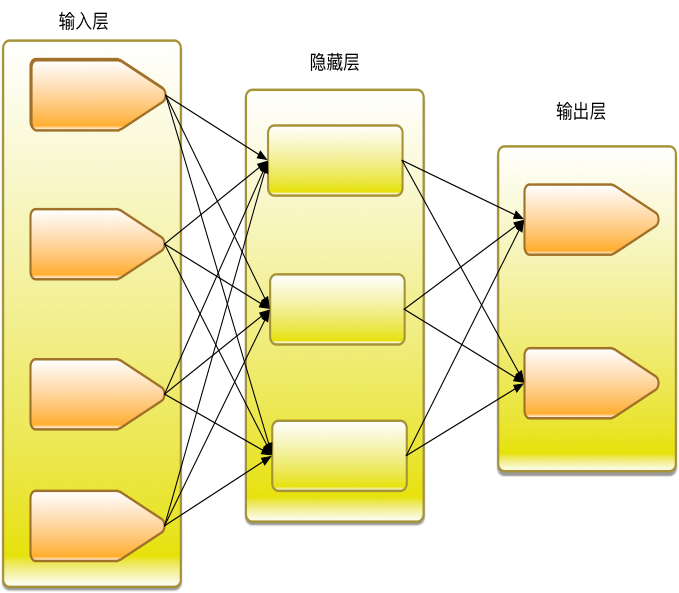

# 多层感知机
## 生活中的神经网络

人的大脑是由无数的神经元组成的复杂网络。神经元是具有长突起的细胞，它由细胞体和轴突、树突组成。

每个神经元可以有一或多个树突，可以接受刺激并将兴奋传入细胞体。每个神经元只有一个轴突，可以把兴奋从胞体传送到另一个神经元或其他组织，如肌肉或腺体。

## 神经网络算法概述
神经网络算法就是模拟了人体神经元的工作原理，多个输入参数，分别具有各自的权重，经过激励函数的处理后，得到输出。输出可以再对接下一级的神经网络的输入，从而组成更加复杂的神经网络。

大脑里的生物神经细胞和其他的神经细胞是相互连接在一起的。为了创建一个人工神经网络，人工神经细胞也要以同样方式相互连接在一起。为此可以有许多不同的连接方式，其中最容易理解并且也是最广泛地使用的，就是把神经细胞一层一层地连结在一起。这一种类型的神经网络就叫前馈网络。

如果对预测错误的神经元施加惩罚，从输出层开始层层向上查找预测错误的神经元，微调这些神经元对应的权重，达到修复错误的目的，这样的算法就叫做反向传播算法。Scikit-learn中的神经网络实现都是使用反向传播算法。本文重点介绍算法在安全领域的应用，神经网络的公式推导请参考其他机器学习专业书籍。

# 数据集
数据集依然使用搜狗实验室提供的"搜狐新闻数据"，该数据来自搜狐新闻2012年6月—7月期间国内，国际，体育，社会，娱乐等18个频道的新闻数据，提供URL和正文信息。 对应的网址为：

	http://www.sogou.com/labs/resource/cs.php
	
我们选择其中数量最大的三个频道的数据进行分析，数据清洗过程请参考我之前的文章《使用fasttext进行文档分类》

# 特征提取
##词袋&TFIDF
特征提取的方式采用词袋结合TFIDF的方式。

    #切割词袋
    vectorizer = CountVectorizer()
    # 该类会统计每个词语的tf-idf权值
    transformer = TfidfTransformer()
    x = transformer.fit_transform(vectorizer.fit_transform(x))
    
##one-hot编码
由于这次需要区分的标签一共有三种，不能直接使用过去二分类问题的方式进行处理了。针对多分类问题，需要使用one-hot编码处理标签。所谓的one-hot编码，又称为一位有效编码，主要是采用位状态寄存器来对个状态进行编码，每个状态都由他独立的寄存器位，并且在任意时候只有一位有效。比如我们有三类标签，就可以编码为：

	[1,0,0]
	[0,1,0]
	[0,0,1]
在keras中可以非常方便的进行转换。

    #转换成one hot编码
    y=to_categorical(t, num_classes=3)
    
# 训练与效果验证
在scikit-learn中构造多层感知机的分类器非常方便，通常只需要设计神经网络的结构即可。本例中设计的隐藏层有两层，结点数分为为5和3。

    #mlp
    clf = MLPClassifier(solver='lbfgs',
                        alpha=1e-5,
                        hidden_layer_sizes=(5, 3),
                        random_state=1)
                        
效果验证使用5折交叉验证，考核的指标是f1和accuracy。使用cross_val_score函数可以非常方便的实现交叉验证的功能，其中cv参数指定交叉验证的方式，比如5代表5折交叉验证。

	 scores = cross_val_score(clf, x, y, cv = 5,scoring='f1_micro')
    print("f1: %0.2f (+/- %0.2f)" % (scores.mean(), scores.std() * 2))

    scores = cross_val_score(clf, x, y, cv = 5,scoring='accuracy')
    print("accuracy: %0.2f (+/- %0.2f)" % (scores.mean(), scores.std() * 2))
    
运行后的效果如下，已经非常理想了。

	f1: 0.98 (+/- 0.04)
	accuracy: 0.97 (+/- 0.05)