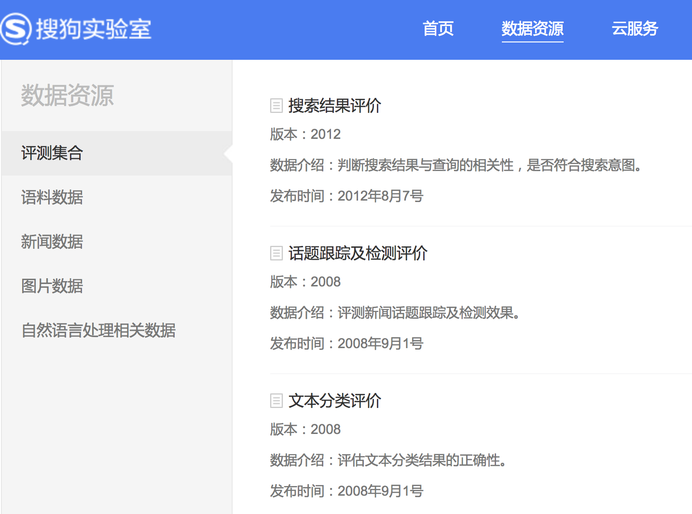
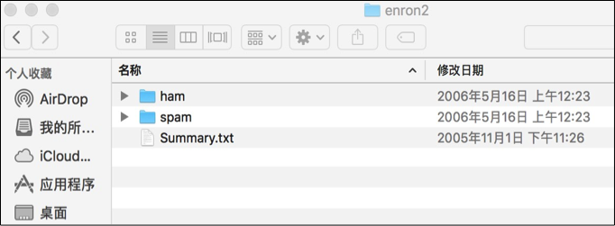

# 概述
数据和算法在NLP中都非常重要，使用公开的数据集可以帮助我们快速学习NLP相关知识并实践，下面我们将介绍常用的几个数据集。

# 搜狗实验室数据

搜狗实验室（Sogo Labs）是搜狗搜索核心研发团队对外交流的窗口，包含数据资源、数据挖掘云、研究合作等几个栏目。数据资源包括评测集合、语料数据、新闻数据、图片数据和自然语言处理相关数据，网址为：
> http://www.sogou.com/labs/resource/list_pingce.php

## 互联网语料库(SogouT)

SogouT来自互联网各种类型的1.3亿个原始网页, 压缩前的大小超过了5TB，格式如下：
	
	<doc>
	
	<docno>页面ID</docno>
	
	<url>页面URL</url>
	
	页面原始内容
	
	</doc>

为了满足不同需求，SogouT分为了不同的版本，差别体现在数据量上：

- 迷你版(样例数据, 61KB)：tar.gz格式,zip格式
- 完整版(1TB)：(硬盘拷贝)
- 历史版本(130GB)：V2.0(硬盘拷贝)

## 全网新闻数据(SogouCA)

SogouCA来自若干新闻站点2012年6月—7月期间国内，国际，体育，社会，娱乐等18个频道的新闻数据，提供URL和正文信息，格式如下：

	<doc>
	
	<url>页面URL</url>
	
	<docno>页面ID</docno>
	
	<contenttitle>页面标题</contenttitle>
	
	<content>页面内容</content>
	
	</doc>

为了满足不同需求，SogouCA分为了不同的版本，差别体现在数据量上：

- 迷你版(样例数据, 101KB)：tar.gz格式，zip格式
- 完整版(711MB)：tar.gz格式，zip格式
- 历史版本：
	- 完整版(同时提供硬盘拷贝,1.02GB)：tar.gz格式
	- 迷你版(样例数据, 3KB)：tar.gz格式
	- 精简版(一个月数据, 437MB)：tar.gz格式
	
## 搜狐新闻数据(SogouCS)

SogouCS来自搜狐新闻2012年6月—7月期间国内，国际，体育，社会，娱乐等18个频道的新闻数据，提供URL和正文信息，格式如下：

	<doc>
	
	<url>页面URL</url>
	
	<docno>页面ID</docno>
	
	<contenttitle>页面标题</contenttitle>
	
	<content>页面内容</content>
	
	</doc>

为了满足不同需求，SogouCS分为了不同的版本，差别体现在数据量上：

- 迷你版(样例数据, 110KB)：tar.gz格式，zip格式
- 完整版(648MB)：tar.gz格式，zip格式
- 历史版本：
	- 完整版(同时提供硬盘拷贝,65GB)：tar.gz格式
	- 迷你版(样例数据, 1KB)：tar.gz格式
	- 精简版(一个月数据, 347MB)：tar.gz格式
	- 特别版(王灿辉WWW08论文数据, 647KB)：tar.gz格式

## 文本分类评价(SogouTCE)

SogouTCE用以评估文本分类结果的正确性，语料来自搜狐等多个新闻网站近20个频道，格式如下：

	URL前缀\t对应类别标记

SogouTCE只包含URL前缀和对应类别标记的数据，原始的文本数据可以使用SogouCA和SogouCS。

## 互联网词库(SogouW)

SogouW来自于对SOGOU搜索引擎所索引到的中文互联网语料的统计分析，统计所进行的时间是2006年10月，涉及到的互联网语料规模在1亿页面以上。统计出的词条数约为15万条高频词，除标出这部分词条的词频信息之外，还标出了常用的词性信息，格式如下：

	词A 词频 词性1 词性2 … 词性N
	
	词B 词频 词性1 词性2 … 词性N
	
	词C 词频 词性1 词性2 … 词性N
	
# IMDB Reviews

互联网电影资料库（Internet Movie Database，简称IMDB）是一个关于电影演员、电影、电视节目、电视明星和电影制作的在线数据库。IMDB Reviews是记录了观众对IMDB中作品的评价。除了训练和测试评估示例之外，还有更多未标记的数据可供使用，包括文本和预处理的词袋格式。IMDB Reviews包含25,000个高度差异化的电影评论用于训练，25,000个测试，通常用于英文的情感理解。

# Sentiment140
Sentiment140是一个可用于情感分析的数据集，包含160,000条推文。一个流行的数据集，非常适合开始你的NLP旅程。情绪已经从数据中预先移除。最终的数据集具有以下6个特征：	

- 推文的极性
- 推文的ID
- 推文的日期
- 问题
- 推文的用户名
- 推文的文本

# Yelp Reviews
Yelp Reviews是Yelp为了学习目的而发布的一个开源数据集。它包含了由数百万用户评论，商业属性和来自多个大都市地区的超过20万张照片。这是一个常用的全球NLP挑战数据集，包含5,200,000条评论，174,000条商业属性。

# Enron-Spam
Enron-Spam数据集是目前在电子邮件相关研究中使用最多的公开数据集，其邮件数据是安然公司（Enron Corporation, 原是世界上最大的综合性天然气和电力公司之一，在北美地区是头号天然气和电力批发销售商）150位高级管理人员的往来邮件。这些邮件在安然公司接受美国联邦能源监管委员会调查时被其公布到网上。机器学习领域使用Enron-Spam数据集来研究文档分类、词性标注、垃圾邮件识别等，由于Enron-Spam数据集都是真实环境下的真实邮件，非常具有实际意义。
Enron-Spam数据集合如下图所示，使用不同文件夹区分正常邮件和垃圾邮件。



正常邮件内容举例如下：

>
Subject: christmas baskets
the christmas baskets have been ordered .
we have ordered several baskets .
individual earth - sat freeze - notis
smith barney group baskets
rodney keys matt rodgers charlie
notis jon davis move
team
phillip randle chris hyde
harvey
freese
faclities

垃圾邮件内容举例如下：

>
Subject: fw : this is the solution i mentioned lscoo
thank you ,
your email address was obtained from a purchased list ,reference # 2020 mid = 3300 . if you wish to unsubscribe
from this list , please click here and enter
your name into the remove box . if you have previously unsubscribed
and are still receiving this message , you may email our abuse
control center , or call 1 - 888 - 763 - 2497 , or write us at : nospam ,
6484 coral way , miami , fl , 33155 " . 2002
web credit inc . all rights reserved .


Enron-Spam数据集对应的网址为：

>
http://www2.aueb.gr/users/ion/data/enron-spam/

