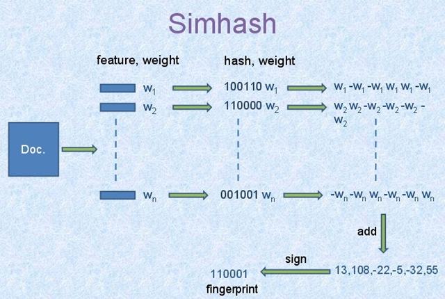
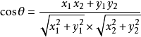
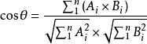

# 概述
每年毕业季，各位学子都会使用一个叫做论文查重系统，来检测是否毕业论文存在抄袭嫌疑。如何衡量两篇论文之间的相似度呢？面对类似的问题，人们提出了文档相似度的概念。文档相似度指的是两篇文档之间的相似程度，也被称为文档距离。文档相似度通常是文本聚类、信息检索等NLP任务的基础，常见的计算文档距离的方法包括simhash和余弦距离。
# simhash算法
simhash是由Charikar在2002年提出来的，论文名为《Similarity estimation techniques from rounding algorithms》。Google基于simhash在海量网页中进行相似度计算并去重。通常对比两个文档是否相同时，会计算对应的hash值，常见的算法包括md5和sha256。实际使用中，对于检测文档是否被篡改时，使用hash值具有不错的表现。但是当文档内容因为修改少许文字，插入广告甚至只是修改了标点符合和错别字，都会导致hash值改变，可是文档的核心内容并未发生改变。如何使用数学的方法表征这种文档相似性呢？simhash的设计初衷就是使用一种所谓局部hash的方法，可以既可以敏感的识别文档的少许修改又可以识别出文档的大多数内容相同。

simhash的一种典型实现就是将一个文档最后转换成一个64位的字节的特征字或者说simhash值，然后判断重复只需要判断他们的特征字的距离是不是小于3，就可以判断两个文档是否相似。这个距离使用海明距离，即两个simhash值取异或后二进制中1的个数。大家可以结合自身业务特点修改simhash值的位数以及判断文档相似性的海明距离的值。

如图所示，计算6位simhash值典型的实现算法为：

- 将Doc分词和计算权重，抽取出n个(关键词，权重)对，即图中的(feature, weight)
- 计算关键词的hash，生成图中的(hash,weight），并将hash和weight相乘，这一过程是对hash值加权
- 将hash和weight相乘的值相加，比如图中的[13, 108, -22, -5, -32, 55]，并最终转换成simhash值110001，转换的规则为正数为1负数为0

## simhash库
simhash具有多种实现，常用的一种已经部署在pip源上了，直接安装即可。

	pip install simhash

有兴趣的读者也可以使用源码安装。

	git clone https://github.com/leonsim/simhash
	cd simhash/
	python setup.py 
	python setup.py install

## 数据集
数据集依然使用搜狗实验室提供的"搜狐新闻数据"，该数据来自搜狐新闻2012年6月—7月期间国内，国际，体育，社会，娱乐等18个频道的新闻数据，提供URL和正文信息。 对应的网址为：

> http://www.sogou.com/labs/resource/cs.php

为了处理方便，我们提取其中前1万条的正文信息，保存到如下文件中：

> ../data/news_sohusite_content_10000.txt

## 数据清洗
为了避免开发环境的编码方式对结果的影响，设置环境的默认编码方式为utf8.

    reload(sys)
    sys.setdefaultencoding('utf8')

加载加载搜狐新闻语料.

	def load_sougou_content():
	    #with open("../data/news_sohusite_content.txt") as F:
	    # 测试阶段仅加载前1w条记录
	    with open("../data/news_sohusite_content_10000.txt") as F:
	        content=F.readlines()
	        F.close()
	    return content

选择其第88篇文章为测试文章，在剩下的语料中寻找与其相似的文档。

    #加载搜狐新闻语料
    content=load_sougou_content()

    #设置测试文章
    print "select test data:"
    test_news=content[88]
    print test_news

测试文档的内容如下：

> 南方日报 讯 　 （ 记者 ／ 黄少宏 　 实习生 ／ 朱子 煜 　 通讯员 ／ 成广伟 ） “ 学习 台北 垃圾 分类 模式 ” 要 全面铺开 ， 部分 小区 试行 垃圾 费 “ 按袋 计量 征收 ” ， 厨余 垃圾 专袋 收运 ． ． ． ． ． ． 这是 记者 昨日 从 广州市 城 管委 庆祝 建党 ９ １ 周年 暨 争先 创优 表彰大会 上 获悉 的 。 据 广州市 城 管委 主任 李廷贵 透露 ， ７ 月 １ ０ 日 将 召开 垃圾 分类 全市 动员大会 ， 并 推出 一系列 政策 。 在 昨日 的 大会 上 ， 针对 垃圾 围城 难题 ， 李廷贵 透露 ， 广州市委 、 市政府 已经 形成 决议 ， 初步 决定 在 ７ 月 １ ０ 日 ， 在 中山纪念堂 召开 动员大会 ， 进行 全面 部署 ， 全面 动员 ， 正式 启动 垃圾 分类 ， 并 将 形成 一整套 法律法规 和 规范 文件 、 配套 实施方案 。 李廷贵 提到 ， 要 采取 ５ 种 垃圾 分类 技术 路线 ， 其中 包括 按袋 计量 。 据介绍 ， 广州 将 于 今年年底 前 选择 １ － ２ 个 生活 小区 试点 “ 垃圾 费 按袋 计量 收费 ” 模式 ， 厨余 垃圾 排放 免费 ， 其他 垃圾 排放 计量 收费 。 至于 “ 垃圾 费 按袋 计量 收费 ” 政策 ， 将 以 专用 垃圾袋 作为 收费 的 工具 ， 市民 丢弃 垃圾 ， 必须 购买 政府 制作 、 在 指定 地点 发售 的 专用 垃圾袋 盛装 ， 再交 垃圾车 收运 。 产生 多少 垃圾 付 多少 钱 ， 垃圾 越 少 ， 缴费 就 越少 。 除 台北 “ 垃圾 不 落地 ” 模式 将 在 广州 进一步 推广 外 ， “ 垃圾袋 实名制 、 垃圾 费 随袋 征收 ” 政策 也 将 在 广州 试点 运行 。 那么 ， 垃圾袋 实名制 将 如何 推行 呢 ？ 据介绍 ， 广州 将 在 政府 特制 的 分类 垃圾袋 上 ， 印 上 居民 的 住宅 地段 号 和 房号 ， 以此 作为 识别 垃圾袋 出自 那家 哪户 的 标志 ， 根据 该 标志 ， 可以 追查 垃圾 投放 的 源头 。 如果 居民 没有 按照 规定 对 垃圾 分类 ， 将 根据 标记 信息 追查 到 居民 个人 。

数据清洗过程，加载我们积累的中文停用词。

	def load_stopwords():
	    with open("stopwords.txt") as F:
	        stopwords=F.readlines()
	        F.close()
	    return [word.strip() for word in stopwords]

为了避免停用词的影响，清洗阶段我们从数据集中删除停用词。

    # 加载积累的stopwords
    stopwords = load_stopwords()

    # 切割token并清除stopwords
    x = [[word for word in line.split() if word not in stopwords] for line in content]

    # 切割token并清除stopwords
    test_news = [word for word in test_news.split() if word not in stopwords]

    # 计算simhash
    test_news_hash = Simhash(test_news)

## 计算simhash值

依次计算语料库中每条记录的simhash，并记录下与测试数据的距离。

    sim=[]
    # 遍历语料计算simhash值
    for news in x:
        hash = Simhash(news)
        score=test_news_hash.distance(hash)
        sim.append( score)
        
选择距离最短的6的文档和序号并打印，因为需要按照score正序排列，需要设置key参数。

    for index, score in sorted(enumerate(sim), key=lambda item: item[1])[:6]:
        print   "index:%d similarities:%f content:%s" % (index, score, content[index])

排名第一的是距离为0的第88号文档，正好就是原文，排名第二的是序号为5644的文档，距离为4，可以发现讲的也是垃圾回收的内容。

> 垃圾袋 印 房号 可追溯 源头 ， 按袋 计量 收费 广州 将 试点 垃圾袋 实名制 垃圾袋 印 房号 可追溯 源头 ， 按袋 计量 收费 “ 学习 台北 垃圾 分类 模式 ” 要 全面铺开 ， 部分 小区 试行 垃圾 费 “ 按袋 计量 征收 ” ， 厨余 垃圾 专袋 收运 … … 这是 记者 近日 从 广州市 城 管委 庆祝 建党 ９ １ 周年 暨 争先 创优 表彰大会 上 获悉 的 。 据 广州市 城 管委 主任 李廷贵 透露 ， ７ 月 １ ０ 日 将 召开 垃圾 分类 全市 动员大会 ， 并 推出 一系列 政策 。 针对 垃圾 围城 难题 ， 李廷贵 透露 ， 广州市委 、 市政府 已经 形成 决议 ， 初步 决定 在 ７ 月 １ ０ 日 ， 在 中山纪念堂 召开 动员大会 ， 进行 全面 部署 ， 全面 动员 ， 正式 启动 垃圾 分类 ， 并 将 形成 一整套 法律法规 和 规范 文件 、 配套 实施方案 。 李廷贵 提到 ， 要 采取 ５ 种 垃圾 分类 技术 路线 ， 其中 包括 按袋 计量 。 据介绍 ， 广州 将 于 今年年底 前 选择 １ － ２ 个 生活 小区 试点 “ 垃圾 费 按袋 计量 收费 ” 模式 ， 厨余 垃圾 排放 免费 ， 其他 垃圾 排放 计量 收费 。 至于 “ 垃圾 费 按袋 计量 收费 ” 政策 ， 将 以 专用 垃圾袋 作为 收费 的 工具 ， 市民 丢弃 垃圾 ， 必须 购买 政府 制作 、 在 指定 地点 发售 的 专用 垃圾袋 盛装 ， 再交 垃圾车 收运 。 产生 多少 垃圾 付 多少 钱 ， 垃圾 越 少 ， 缴费 就 越少 。

# 余弦距离

余弦距离，又称为余弦相似性，是通过计算两个向量的夹角余弦值来评估他们的相似度。余弦相似度将向量根据坐标值，绘制到向量空间中，如最常见的二维空间。假设向量a、b的坐标分别为(x1,y1)、(x2,y2) ,则对应的余弦距离为：

设向量 A = (A1,A2,...,An)，B = (B1,B2,...,Bn) 。推广到多维:

夹角越小，余弦值越接近于1，它们的方向更加吻合，则越相似。可见余弦距离在0和1之间且约接近1说明越两者越相似。

## 数据集
数据集也和simhash使用相同的数据集。

## 数据清洗
数据清洗方式与simhash类似，只不过多了一个TFIDF处理。

    # 加载积累的stopwords
    stopwords = load_stopwords()

    # 切割token并清除stopwords
    x = [[word for word in line.split() if word not in stopwords] for line in content]

    # 获取词袋
    dictionary = corpora.Dictionary(x)

    # 制作语料
    corpus = [dictionary.doc2bow(doc) for doc in x]

    # 进行TFIDF处理
    tfidf = models.TfidfModel(corpus)
    
    # 把测试文章转换成tfidf
    test_news_vec = [word for word in test_news.split() if word not in stopwords]

    test_news_vec = tfidf[dictionary.doc2bow(test_news_vec)]

词袋提取使用的是gensim的库，生成的矩阵为稀疏矩阵。

## 计算余弦距离
gensim库封装实现了针对稀疏矩阵计算余弦距离的类，直接调用即可。由于需要按照score的倒序排列，所以使用key参数。

	index = similarities.SparseMatrixSimilarity(tfidf[corpus], num_features=len(dictionary.keys()))
	sim = index[tfidf[test_news_vec]]
	
	for index, score in sorted(enumerate(sim), key=lambda item: -item[1])[:6]:
	 	print   "index:%d similarities:%f content:%s" % (index, score, content[index])

排名第一的是距离为0.965616的第88号文档，正好就是原文，排名第二的是序号为5644的文档，距离为40.907202，可以发现讲的也是垃圾回收的内容。

# 参考文献
- https://yanyiwu.com/work/2014/01/30/simhash-shi-xian-xiang-jie.html
