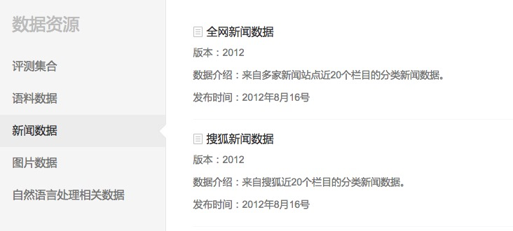

# 训练语料
word2vec的算法是公开的，word2vec模型的质量完全取决于训练语料的质量。目前免费开放的预料不多，中文语料更是凤毛麟角。
	

这里推荐使用搜狗实验室的中文语料，对应的网址为：

	http://www.sogou.com/labs/resource/cs.php

通常使用"搜狐新闻数据"即可，该数据来自搜狐新闻2012年6月—7月期间国内，国际，体育，社会，娱乐等18个频道的新闻数据，提供URL和正文信息。

## 数据格式

	<doc>
	
	<url>页面URL</url>
	
	<docno>页面ID</docno>
	
	<contenttitle>页面标题</contenttitle>
	
	<content>页面内容</content>
	
	</doc>

注意：content字段去除了HTML标签，保存的是新闻正文文本

## 数据文件
搜狐新闻数据区根据文件格式和数据规模细分为以下几种：

- 迷你版(样例数据, 110KB)：tar.gz格式，zip格式

- 完整版(648MB)：tar.gz格式，zip格式

- 历史版本：2008版(6KB)：完整版(同时提供硬盘拷贝,65GB)：tar.gz格式

# 数据预处理
## 提取中文内容
原始数据中包含完整的html文件，所以需要提取其中的中文内容，通常提取其中`<content>`标签包含的内容即可。

	tar -zxvf news_sohusite_xml.full.tar.gz
	cat news_sohusite_xml.full.tar.gz | iconv -f gb18030 -t utf-8 | grep "<content>" > news_sohusite.txt
	sed -i "" 's/<content>//g' news_sohusite.txt
	sed -i "" 's/<\/content>//g' news_sohusite.txt

其中iconv命令的格式为：

	iconv -f encoding [-t encoding] [inputfile]... 

参数含义为：

- -f encoding :把字符从encoding编码开始转换。 
- -t encoding :把字符转换到encoding编码。 
- -l :列出已知的编码字符集合 
- -o file :指定输出文件 
- -c :忽略输出的非法字符 
- -s :禁止警告信息，但不是错误信息 
- --verbose :显示进度信息 
- -f和-t所能指定的合法字符在-l选项的命令里面都列出来了

## 中文切词
与处理英文不同，中文没有切词，需要使用jieba进行切词处理。

	python -m jieba -d ' ' news_sohusite.txt > news_sohusite_cutword.txt

# 训练word2vec
完成预处理后，级可以利用gensim库进行训练。

	def train_word2vec(filename):
	    #模型文件不存在才处理
	    if not os.path.exists(word2vec_file):
	        sentences = LineSentence(filename)
	        #sg=0 使用cbow训练, sg=1对低频词较为敏感
	        model = Word2Vec(sentences,
	                         size=n_dim, window=5, min_count=2, sg=1, workers=2)
	        model.save(word2vec_file)

- sentences表示需要处理的语料
- size表示word2vec的维数，一般50-300
- window表示处理word时的窗口长度
- min_count表示处理分析的word出现的最小次数
- sg为1表示使用skip-gram算法，为0为cbow
- workers表示计算使用的线程数
- iter表示迭代计算的次数

# 使用word2vec处理中文
把一个中文句子使用词向量表示的方法。对于类似短信、微博、标题这些长度较短的文字，可以使用各个word的word2vec相加取平均来表示。对训练数据集创建词向量，接着进行比例缩放（scale)。

	def buildWordVector(imdb_w2v,text, size):
	    vec = np.zeros(size).reshape((1, size))
	    count = 0.
	    #print text
	    for word in text.split():
	        #print word
	        try:
	            vec += imdb_w2v[word].reshape((1, size))
	            count += 1.
	        except KeyError:
	            print word
	            continue
	    if count != 0:
	        vec /= count
	    return vec

当需要把中文数据集X转换成word2vec，可以使用如下方式。

	#加载训练好的词向量模型
	model = Word2Vec.load(word2vec_file)
	
	x_vecs = np.concatenate([buildWordVector(model,z, n_dim) for z in x])
	x_vecs = scale(x_vecs)

# 测试效果
下面我们测试生成的word2vec模型的质量。
## 寻找近义词
寻找近义词是word2vec的一个应用场景。
### 百度的近义词
	print pd.Series(model.most_similar(u'百度'))
	0      (网易, 0.844283640385)
	1    (搜索引擎, 0.822018146515)
	2      (腾讯, 0.774820387363)
	3       (搜狗, 0.76777946949)
	4      (新浪, 0.760137319565)
	5      (奇虎, 0.745484173298)
	6      (文库, 0.725166857243)
	7    (手机软件, 0.717750906944)
	8       (优酷, 0.70574760437)
	9      (客户端, 0.70448333025)
### 微信的近义词
	print pd.Series(model.most_similar(u'微信'))
	0     (摇一摇, 0.768034994602)
	1      (陌陌, 0.763847649097)
	2    (网上聊天, 0.751431167126)
	3    (聊天工具, 0.731707036495)
	4      (盗号, 0.722806692123)
	5      (飞聊, 0.715048789978)
	6      (手机, 0.706719994545)
	7     (发短信, 0.704942345619)
	8      (聊天, 0.691777765751)
	9    (账号密码, 0.679741084576)

## 单词运算
word2vec的一个神奇之处就是把文字转换成了数字，数字之间的加减运算，同样适用于word2vec。
### 足球+明星
	print pd.Series(model.most_similar(positive=[u'足球'+u'明星']))
	0      (巨星, 0.741350233555)
	1    (光芒万丈, 0.727712750435)
	2     (和亨利, 0.722848057747)
	3      (球星, 0.722578346729)
	4       (已贵, 0.71345859766)
	5     (格米利, 0.694822609425)
	6     (支斯篮, 0.690492749214)
	7      (田坛, 0.689639627934)
	8      (体坛, 0.689606904984)
	9     (竞神锋, 0.684816122055)

### 球星-明星

	print pd.Series(model.most_similar(positive=[u'球星'],negative=[u'明星']))
	dtype: object
	0    (国际米兰, 0.492849290371)
	1      (中锋, 0.480526059866)
	2      (球员, 0.479797780514)
	3     (上赛季, 0.479528963566)
	4      (主帅, 0.479275196791)
	5      (球队, 0.477513790131)
	6     (德里奇, 0.474446773529)
	7     (热那亚, 0.472252100706)
	8      (中场, 0.459134191275)
	9       (巴萨, 0.45858669281)

## 比较单词的相似度

### 比较微信和陌陌

	print model.wv.similarity(u'微信', u'陌陌')
	0.763847656891

### 比较男人和坏人

	print model.wv.similarity(u'男人', u'坏人')
	0.617036796702