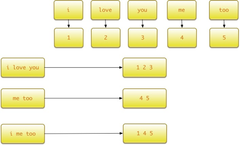

# 词袋模型
文本特征提取有两个非常重要的模型：

- 词集模型：单词构成的集合，集合自然每个元素都只有一个，也即词集中的每个单词都只有一个。

- 词袋模型：在词集的基础上如果一个单词在文档中出现不止一次，统计其出现的次数（频数）。

两者本质上的区别，词袋是在词集的基础上增加了频率的维度，词集只关注有和没有，词袋还要关注有几个。
假设我们要对一篇文章进行特征化，最常见的方式就是词袋。
导入相关的函数库：

    >>> from sklearn.feature_extraction.text import CountVectorizer

实例化分词对象：

    >>> vectorizer = CountVectorizer(min_df=1)
    >>> vectorizer                    
    CountVectorizer(analyzer=...'word', binary=False, decode_error=...'strict',
            dtype=<... 'numpy.int64'>, encoding=...'utf-8', input=...'content',
            lowercase=True, max_df=1.0, max_features=None, min_df=1,
            ngram_range=(1, 1), preprocessor=None, stop_words=None,
            strip_accents=None, token_pattern=...'(?u)\\b\\w\\w+\\b',
            tokenizer=None, vocabulary=None)
            
将文本进行词袋处理：

    >>> corpus = [
    ...     'This is the first document.',
    ...     'This is the second second document.',
    ...     'And the third one.',
    ...     'Is this the first document?',
    ... ]
    >>> X = vectorizer.fit_transform(corpus)
    >>> X                             
    <4x9 sparse matrix of type '<... 'numpy.int64'>'
        with 19 stored elements in Compressed Sparse ... format>
        
获取对应的特征名称：

    >>> vectorizer.get_feature_names() == (
    ...     ['and', 'document', 'first', 'is', 'one',
    ...      'second', 'the', 'third', 'this'])
    True
    
获取词袋数据，至此我们已经完成了词袋化：

    >>> X.toarray()          
    array([[0, 1, 1, 1, 0, 0, 1, 0, 1],
           [0, 1, 0, 1, 0, 2, 1, 0, 1],
           [1, 0, 0, 0, 1, 0, 1, 1, 0],
           [0, 1, 1, 1, 0, 0, 1, 0, 1]]...)

但是如何可以使用现有的词袋的特征，对其他文本进行特征提取呢？我们定义词袋的特征空间叫做词汇表vocabulary：

    vocabulary=vectorizer.vocabulary_
    
针对其他文本进行词袋处理时，可以直接使用现有的词汇表：

    >>> new_vectorizer = CountVectorizer(min_df=1, vocabulary=vocabulary)
    
CountVectorize函数比较重要的几个参数为：

- decode_error，处理解码失败的方式，分为‘strict’、‘ignore’、‘replace’三种方式。
- strip_accents，在预处理步骤中移除重音的方式。
- max_features，词袋特征个数的最大值。
- stop_words，判断word结束的方式。
- max_df，df最大值。
- min_df，df最小值 。
- binary，默认为False，当与TF-IDF结合使用时需要设置为True。
本例中处理的数据集均为英文，所以针对解码失败直接忽略，使用ignore方式，stop_words的方式使用english，strip_accents方式为ascii方式。

# TF-IDF模型
文本处理领域还有一种特征提取方法，叫做TF-IDF模型（term frequency–inverse document frequency，词频与逆向文件频率）。TF-IDF是一种统计方法，用以评估某一字词对于一个文件集或一个语料库的重要程度。字词的重要性随着它在文件中出现的次数成正比增加，但同时会随着它在语料库中出现的频率成反比下降。TF-IDF加权的各种形式常被搜索引擎应用，作为文件与用户查询之间相关程度的度量或评级。
TF-IDF的主要思想是，如果某个词或短语在一篇文章中出现的频率TF(Term Frequency，词频)，词频高，并且在其他文章中很少出现，则认为此词或者短语具有很好的类别区分能力，适合用来分类。TF-IDF实际上是：TF * IDF。TF表示词条在文档d中出现的频率。IDF（inverse document frequency，逆向文件频率）的主要思想是：如果包含词条t的文档越少，也就是n越小，IDF越大，则说明词条t具有很好的类别区分能力。如果某一类文档C中包含词条t的文档数为m，而其他类包含t的文档总数为k，显然所有包含t的文档数n=m+k，当m大的时候，n也大，按照IDF公式得到的IDF的值会小，就说明该词条t类别区分能力不强。但是实际上，如果一个词条在一个类的文档中频繁出现，则说明该词条能够很好代表这个类的文本的特征，这样的词条应该给它们赋予较高的权重，并选来作为该类文本的特征词以区别与其他类文档。
在Scikit-Learn中实现了TF-IDF算法，实例化TfidfTransformer即可：

    >>> from sklearn.feature_extraction.text import TfidfTransformer
    >>> transformer = TfidfTransformer(smooth_idf=False)
    >>> transformer    
    TfidfTransformer(norm=...'l2', smooth_idf=False, sublinear_tf=False, use_idf=True)
TF-IDF模型通常和词袋模型配合使用，对词袋模型生成的数组进一步处理：

    >>> counts = [[3, 0, 1],
    ...           [2, 0, 0],
    ...           [3, 0, 0],
    ...           [4, 0, 0],
    ...           [3, 2, 0],
    ...           [3, 0, 2]]
    ...
     >>> tfidf = transformer.fit_transform(counts)
    >>> tfidf                         
    <6x3 sparse matrix of type '<... 'numpy.float64'>'     with 9 stored elements in Compressed Sparse ... format> 
    >>> tfidf.toarray()                         
    array([[ 0.81940995,  0.        ,  0.57320793],       
    [ 1.        ,  0.        ,  0.        ],      
    [ 1.        ,  0.        ,  0.        ],  
    [ 1.        ,  0.        ,  0.        ],       
    [ 0.47330339,  0.88089948,  0.        ],       
    [ 0.58149261,  0.        ,  0.81355169]])

# 词汇表模型
词袋模型可以很好的表现文本由哪些单词组成，但是却无法表达出单词之间的前后关系，于是人们借鉴了词袋模型的思想，使用生成的词汇表对原有句子按照单词逐个进行编码。TensorFlow默认支持了这种模型：

    tf.contrib.learn.preprocessing.VocabularyProcessor (
                                              max_document_length,    
                                              min_frequency=0,
                                              vocabulary=None,
                                              tokenizer_fn=None)
其中各个参数的含义为：

- max_document_length:，文档的最大长度。如果文本的长度大于最大长度，那么它会被剪切，反之则用0填充。
- min_frequency，词频的最小值，出现次数小于最小词频则不会被收录到词表中。
- vocabulary，CategoricalVocabulary 对象。
- tokenizer_fn，分词函数。

假设有如下句子需要处理：

    x_text =[
        'i love you',
        'me too'
    ]

基于以上句子生成词汇表，并对'i me too'这句话进行编码：

    vocab_processor = learn.preprocessing.VocabularyProcessor(max_document_length)
    vocab_processor.fit(x_text)
    print next(vocab_processor.transform(['i me too'])).tolist()
    x = np.array(list(vocab_processor.fit_transform(x_text)))
    print x
    
运行程序，x_text使用词汇表编码后的数据为：
 [[1 2 3 0]
 [4 5 0 0]]
'i me too'这句话编码的结果为：
[1, 4, 5, 0]
整个过程如下图所示。

